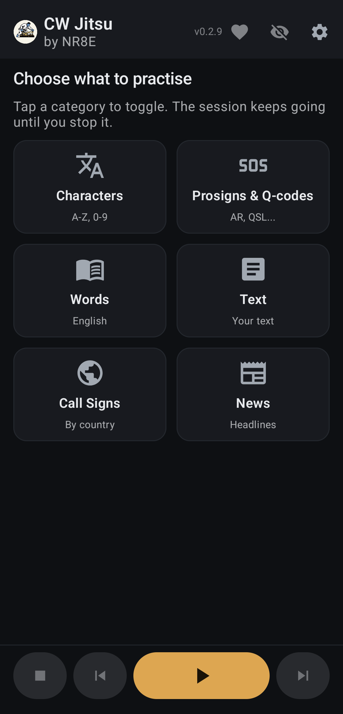
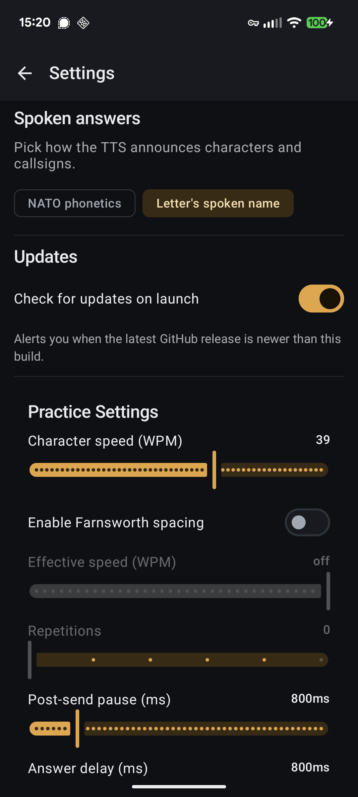
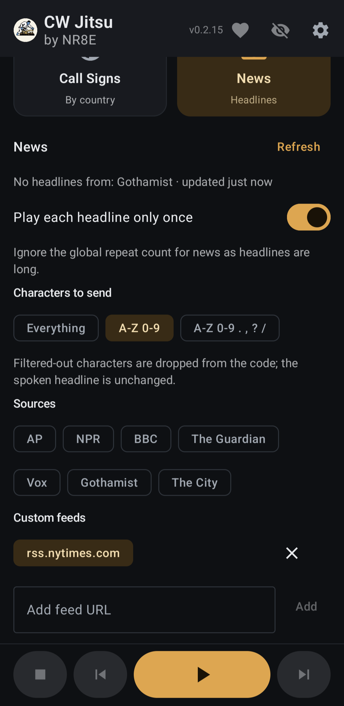

# CW Jitsu

A Morse code (CW) listening-practice app for Android, by NR8E. Pick what to
hear, press Play, and copy code continuously until you stop with spoken
answers after each item so you can check yourself hands-free.

<p>
  
  
  
</p>

## Features

- **Interesting practice**: Select from some common news sources or add your
  own RSS/Atom feeds to listen to.
- **Practice content**: characters, CW shorthand (prosigns, Q-codes, abbreviations), English words, your
  own text, callsigns by country (with optional `/prefix` and `/suffix`
  decoration), and live news headlines from RSS feeds, cached offline-first
  so practice never waits on a connection.
- **Spoken answers** after each item (NATO phonetics or plain letters), with
  optional replay of the code after the answer and a courtesy tone between
  items.
- **Realism**: Farnsworth spacing, straight-key timing slop, randomized tone
  frequency, QSB-style per-item volume variation, and white/brown background
  noise.
- **Runs like a media app**: play/pause/skip from the notification, lock
  screen, or Bluetooth controls; sessions keep going in the background.

## Install

Grab the APK from the [latest release](https://github.com/EvanBoyar/cwjitsu/releases/latest)
and install it (you may need to allow installs from unknown sources). The app
can check for newer releases on launch.

## Build

```sh
./gradlew assembleDebug   # output: app/build/outputs/apk/debug/app-debug.apk
```

Release builds are produced by CI when a `v*` tag is pushed — see
`.github/workflows/release.yml`.
